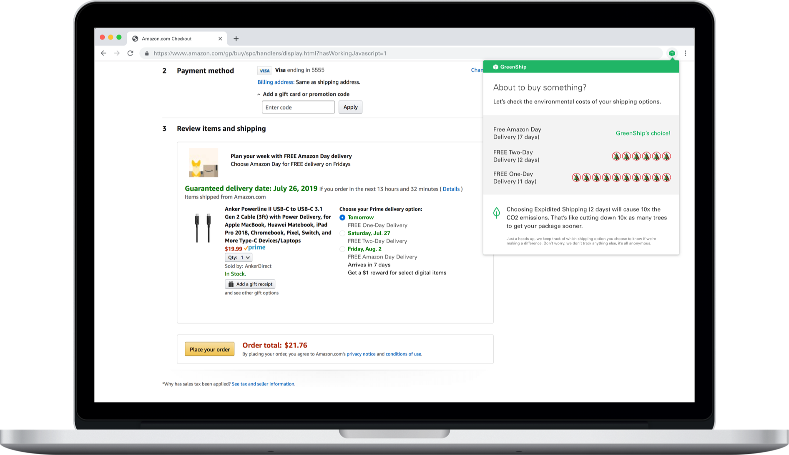

  

Discover how you can reduce your carbon footprint by choosing different shipping option. 

Check us out on the [Chrome Store Now!](https://chrome.google.com/webstore/detail/greenship/njeakmnnedingkbbihcmbaaopflnhadj)

Also check out our [demo video!](https://youtu.be/JYcEX5uEMWc)

<a href="https://twitter.com/getgreenship">Check us out on Twitter!</a>

## How to Use GreenShip

1. Shop like normal

2. On the checkout page you will be presented with the a Greenship modal. This will tell you about the environmental impact of your shipping decisions.

  

3. Click anywhere on the screen for the Greenship modal to dissapear.

4. Want to see the information again? Click on the GreenShip Logo in the top right hand corner

  

## How to Install in Dev Mode

1. Download this Extension as a Zip file [here](https://github.com/NickEngmann/GreenShip/archive/master.zip).

2. Unzip the Extension (GreenShip.zip -> Greenship Folder)

3. Open Google Chrome Browser and open the Extension Management page by navigating to chrome://extensions in a Chrome browser.

4. Enable Developer Mode by clicking toggle button/switch next to Developer Mode.  

5. Click the Load Unpacked button and select the folder where users saved the extension.

  

6. Users are ready to run the extension

# License

This project is [MIT licensed](./LICENSE.md).

# Contributors:

[Anu Jayasinghe](https://anujaya.com)
[Nick Engmann](https://nickengmann.com)
[Nate Reicher]()